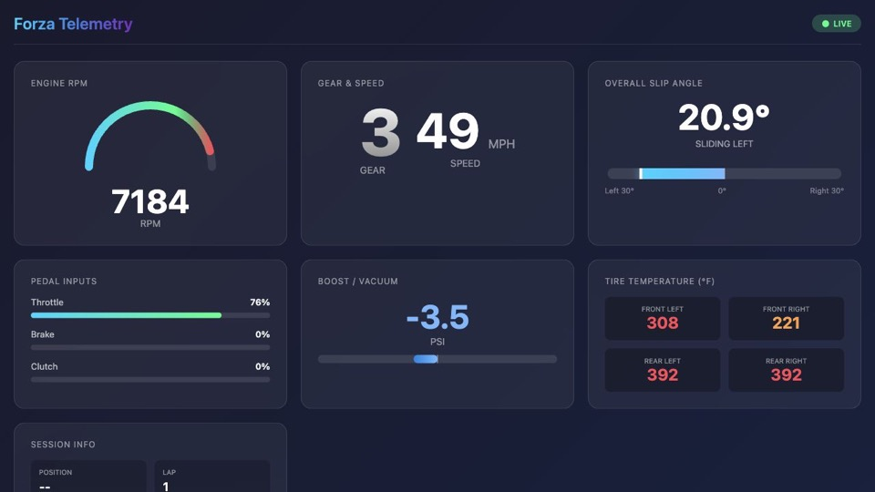

# Forza Data Tools

Tools for reading Forza Data Out UDP telemetry, printing live values in the terminal, logging CSV data, and serving a browser dashboard.

## Supported Games

- Forza Motorsport 7
- Forza Motorsport (2023) and newer Motorsport titles
- Forza Horizon 4, 5, and 6 with the `-z` flag

## Features

- Realtime telemetry output in the terminal
- CSV telemetry logging
- Built-in live web dashboard using WebSockets for fast updates
- Raw telemetry JSON over HTTP
- Race/drive statistics from CSV logs

## Dashboard Preview



## Prerequisites

Install Go from [https://go.dev/dl/](https://go.dev/dl/) or with your package manager:

```sh
brew install go
```

Check that Go is available:

```sh
go version
```

Any recent Go version should work.

## Build

Build the app from the repository directory:

```sh
go build -o fdt
```

On Windows:

```sh
go build -o fdt.exe
```

This creates an executable named `fdt` or `fdt.exe`.

## Game Setup

1. In your Forza HUD/gameplay options, enable **Data Out**.
2. Set the destination IP address to your computer's IP address. The app prints this address when it starts.
3. Set the Data Out port to `9999`.
4. For Motorsport games, select **car dash** format when the option is available.
5. For Horizon games, run this app with `-z`.

If RPM looks correct but speed, tire temperatures, gear, or lap values are wildly wrong, the app is probably using the wrong packet layout. Restart with `-z` for Horizon games, and without `-z` for Motorsport games.

## Run

### Options

| Flag | Description |
| --- | --- |
| `-c log.csv` | Log telemetry to a CSV file. Existing files are overwritten. |
| `-z` | Use the Horizon packet layout for Forza Horizon 4/5/6. |
| `-j` | Enable the JSON/WebSocket server and browser dashboard. |
| `-q` | Disable realtime terminal output. |
| `-d` | Enable debug logging. |

### Examples

Forza Horizon 4/5/6:

```sh
./fdt -z -j -c log.csv
```

Forza Motorsport:

```sh
./fdt -j -c log.csv
```

Dashboard-only, quiet terminal mode:

```sh
./fdt -z -j -q
```

On Windows, use `fdt.exe` instead of `./fdt`.

## Dashboard And JSON

When `-j` is enabled, open the dashboard at:

<http://localhost:8080/forza>

The dashboard subscribes to `/forza/ws` over WebSockets for live updates.

Raw JSON is available at:

<http://localhost:8080/forza.json>

The JSON format is an array of objects containing the parsed Forza telemetry fields. A sample is available at [dash/sample.json](dash/sample.json).

The older standalone example dashboard remains in [dash/index.html](dash/index.html).

## Troubleshooting

- **`go: command not found`**: Install Go and make sure it is on your `PATH`.
- **Module download errors**: Run `go mod download`.
- **No dashboard at `localhost:8080`**: Start the app with `-j`, then open `/forza`.
- **RPM is plausible but speed/temps are wrong**: Use `-z` for Horizon games; omit `-z` for Motorsport games.
- **No telemetry arrives**: Confirm Data Out is enabled in Forza, the destination IP matches your computer, and the port is `9999`.

## Further Reading

- [Forza Motorsport Data Out documentation](https://support.forzamotorsport.net/hc/en-us/articles/21742934024211-Forza-Motorsport-Data-Out-Documentation)
- [Forza Motorsport Data Out forum thread](https://forums.forza.net/t/data-out-feature-in-forza-motorsport/651333)
- [Forza Horizon 5 Data Out structure discussion](https://forums.forza.net/t/data-out-telemetry-variables-and-structure/535984)
